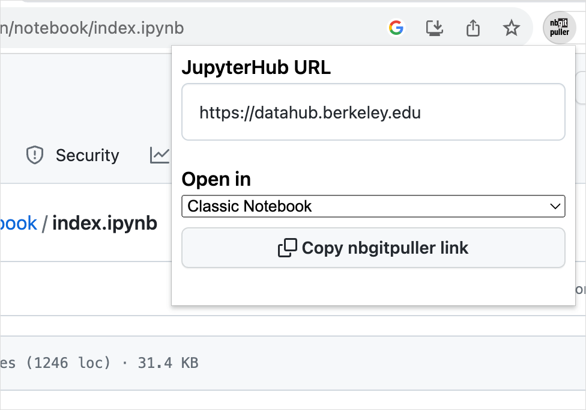

# nbgitpuller Link Generator WebExtension

A browser extension to help you generate [nbgitpuller](https://jupyterhub.github.io/nbgitpuller/)
links directly from GitHub.

[Install Firefox Extension](https://addons.mozilla.org/en-US/firefox/addon/nbgitpuller-link-generator/?utm_source=addons.mozilla.org&utm_medium=referral&utm_content=search)

## What does this do?

It adds an icon to the browser toolbar which will be enabled whenever you are on GitHub.

On clicking the button, a form pops up. You can enter a JupyterHub URL and the application
you want to use to open this file, folder or repository. Then you
can just copy the nbgitpuller URL, and share it with your students!



The JupyterHub URL and application you choose are remembered, so
you do not need to enter it over and over again.

## Installation

### On Firefox

The preferred, easy method to install and keep the extension up to date is to install it
from the [addons.mozilla.org](https://addons.mozilla.org/en-US/firefox/addon/nbgitpuller-link-generator/?utm_source=addons.mozilla.org&utm_medium=referral&utm_content=search).

### On Chrome

The preferred, easy method to install and keep the extension up to date is to install it
from the [the Chrome Web Store](https://chrome.google.com/webstore/detail/nbgitpuller-link-generato/hpdbdpklpmppnoibabdkkhnfhkkehgnc).

## Manual Installation

### On Firefox

1. Download the `.zip` version of the latest [release](https://github.com/yuvipanda/nbgitpuller-link-generator/releases)
   of the extension. You want the file named `nbgitpuller_link_generator-<version>.zip`.
2. In your firefox, go to the [about:debugging](about:debugging#/runtime/this-firefox) page,
   and select the 'This Firefox' tab on the left.
3. Under *Temporary Extensions*, click *Load Temporary Add-on...*.
4. Navigate to the `.zip` file you downloaded in step 1, and select that
5. This should enable the addon! If you go to any repo on GitHub, you should see
   the nbgitpuller button now!

You can find more information [here](https://developer.mozilla.org/en-US/docs/Tools/about:debugging#extensions).

### On Google Chrome / Chromium

1. Download the `.zip` version of the latest [release](https://github.com/yuvipanda/nbgitpuller-link-generator/releases)
   of the extension. You want the file named `nbgitpuller_link_generator-<version>.zip`.
2. Extract the `.zip` file you downloaded.
3. In your Google Chrome / Chromium, go to [chrome://extensions](chrome://extensions/).
4. Enable the *Developer Mode* toggle in the top right. This should make a few options visible
   in a new toolbar.
5. Select *Load Unpacked*, and select the directory into which the downloaded `.zip` file
   was extracted to. This directory should contain at least a `manifest.json` file that
   was part of the `.zip` file.

You can find more information [here](https://developer.chrome.com/docs/extensions/mv3/getstarted/#manifest).

## Building the webextension

```bash
npm install
npx webpack --mode=production
```

Then build for either browser: (They have slightly different manifest files)

```
npx web-ext build -s dist-firefox/ -a web-ext-artifacts-firefox --overwrite-dest
npx web-ext build -s dist-chrome/ -a web-ext-artifacts-chrome --overwrite-dest
```

This produces a `.zip` file in each `web-ext-artifacts*` folder that you can use.